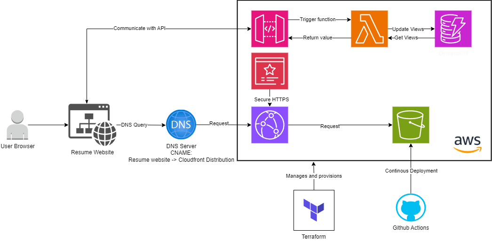

# AWS Cloud Resume Challenge

## 📚 Overview

This project is my attempt at the [Cloud Resume Challenge](https://cloudresumechallenge.dev/) created by Forrest Brazeal. The challenge is a multi-step project designed to help build and demonstrate essential cloud skills. The objective is to create a cloud-hosted resume website, showcasing skills in cloud architecture and DevOps practices.

## 📐 Architecture

 <!-- Replace with the path to your architecture diagram image -->

The architecture of this project includes the following components:

- **Amazon S3**: Hosting the static content of the resume website.
- **AWS CloudFront**: Serving the website through a content delivery network for improved performance and global distribution.
- **AWS Certificate Manager**: Providing an SSL/TLS certificate for securing the website with HTTPS.
- **AWS Lambda**: Handling backend logic for dynamic interactions, such as resume form submissions.
- **Amazon DynamoDB**: Storing data submitted through the resume form.
- **GitHub Actions**: Automating the CI/CD pipeline for deployment.
- **Terraform**: Managing infrastructure as code for provisioning and managing AWS resources.

## 🚀 Features

- **Static Website Hosting**: Resume website hosted on Amazon S3.
- **Custom Domain & SSL**: Secure access with HTTPS using AWS Certificate Manager.
- **Content Delivery Network**: Fast and reliable website delivery using AWS CloudFront.
- **Dynamic Backend**: Serverless backend implemented with AWS Lambda for form handling.
- **Data Storage**: Submission data stored in DynamoDB.
- **Automated Deployment**: Continuous integration and deployment using GitHub Actions.
- **Infrastructure Management**: Managed infrastructure using Terraform.

## 🛠️ Technologies Used

- **Frontend**: HTML, CSS, JavaScript
- **Backend**: AWS Lambda
- **Database**: Amazon DynamoDB
- **Hosting**: Amazon S3
- **CDN**: AWS CloudFront
- **SSL/TLS**: AWS Certificate Manager
- **CI/CD**: GitHub Actions
- **Infrastructure as Code**: Terraform

## 💻 Setup & Deployment

### Prerequisites

- **AWS Account**: Required for deploying resources and managing services.
- **Terraform**: Install Terraform to manage infrastructure.
- **GitHub Account**: For repository and CI/CD pipeline setup.

### Setup Instructions

1. **Clone the Repository**

   ```bash
   git clone https://github.com/markme44/aws-cloud-resume-challenge.git
   cd aws-cloud-resume-challenge
   ```

2. **Configure Terraform**
   - Update the `terraform/main.tf` file with your AWS region and any other configurations specific to your setup.
   - Initialize Terraform:

     ```bash
     terraform init
     ```

   - Apply the Terraform configuration to provision resources:

     ```bash
     terraform apply
     ```

3. **Deploy the Website**
   - Upload your static website files to the S3 bucket created by Terraform.

4. **Set Up GitHub Actions**
   - Configure GitHub Actions in your repository to automate deployment. Ensure you have the appropriate IAM roles and permissions set up.

5. **Verify Deployment**
   - Visit the CloudFront distribution URL to ensure your resume website is live and functioning.

## 🔧 Usage

1. **Visit the Website**: Navigate to the CloudFront URL or custom domain to view your resume.
2. **Visitor Counter**: Visitor counter will automatically update, which will be handled by AWS Lambda and stored in DynamoDB.
3. **Monitor and Manage**: Use AWS Management Console to monitor resources and manage configurations.


## 🛠️ Known Issues

- **SSL Certificate Propagation**: It may take some time for the SSL certificate to be fully propagated and recognized.
- **CloudFront Caching**: Cached content might delay the visibility of changes. Clear cache if necessary.

## 📞 Contact

For questions or support, please contact:

- **Email**: [markme44.mm@gmail.com](mailto:markme44.mm@gmail.com)
- **GitHub Issues**: [Submit an Issue](https://github.com/markme44/aws-cloud-resume-challenge/issues)

---

Thank you for exploring my AWS Cloud Resume Challenge project! Feel free to get in touch for any questions.
