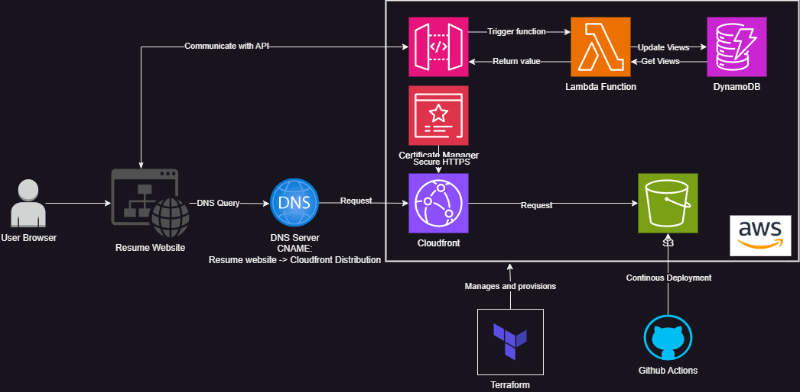

# AWS Cloud Resume Challenge

## 📚 Overview

This project is my attempt at the [Cloud Resume Challenge](https://cloudresumechallenge.dev/) created by Forrest Brazeal. The challenge is a multi-step project designed to build and demonstrate essential cloud skills. The objective is to create a cloud-hosted resume website, showcasing skills in cloud architecture and DevOps practices.

You can view the live project [here](https://www.markjohnignacio.com).

## 📐 Architecture

 <!-- Replace with the path to your architecture diagram image -->

The architecture of this project includes the following components:

- **Amazon S3**: Hosts the static content of the resume website.
- **AWS CloudFront**: Delivers the website through a content delivery network for improved performance and global distribution.
- **AWS Certificate Manager**: Provides an SSL/TLS certificate for securing the website with HTTPS.
- **AWS Lambda**: Manages backend logic for dynamic viewer count.
- **Amazon DynamoDB**: Stores data related to the viewer count, incremented with each visit.
- **GitHub Actions**: Automates the CI/CD pipeline for deployment of both frontend and Terraform infrastructure.
- **Terraform**: Manages infrastructure as code for provisioning and managing AWS resources.

## 🚀 Features

- **Static Website Hosting**: Resume website hosted on Amazon S3.
- **Custom Domain & SSL**: Secure access with HTTPS using AWS Certificate Manager.
- **Content Delivery Network**: Fast and reliable website delivery using AWS CloudFront.
- **Dynamic Backend**: Serverless backend with AWS Lambda for tracking visitor count.
- **Data Storage**: Viewer count data stored in DynamoDB.
- **Automated Deployment**: Continuous integration and deployment with GitHub Actions.
- **Infrastructure Management**: Managed infrastructure using Terraform.

## 🛠️ Technologies Used

- **Frontend**: HTML, CSS
- **Backend**: AWS Lambda, JavaScript
- **Database**: Amazon DynamoDB
- **Hosting**: Amazon S3
- **CDN**: AWS CloudFront
- **SSL/TLS**: AWS Certificate Manager
- **CI/CD**: GitHub Actions
- **Infrastructure as Code**: Terraform

## 💻 Setup & Deployment

### Prerequisites

- **AWS Account**: Required for deploying resources and managing services. Configure your AWS account on the CLI by running:

  ```bash
  aws configure
  ```

  Enter the Access Key ID and Secret Access Key for the IAM user that will be used to run Terraform.

- **Terraform**: Install Terraform to manage infrastructure. Follow the installation instructions on the [Terraform website](https://www.terraform.io/downloads.html).

- **GitHub Account**: Required for repository and CI/CD pipeline setup.

### Setup Instructions

1. **Clone the Repository**

   ```bash
   git clone https://github.com/markme44/aws-cloud-resume-challenge.git
   cd aws-cloud-resume-challenge
   ```

2. **Configure Terraform**

   #### Option 1: Using a `terraform.tfvars` File

   1. **Create a `terraform.tfvars` File**  
      Add your AWS region and other configurations to the `terraform.tfvars` file:

      ```hcl
      aws_region               = "your-aws-region"
      bucket_name              = "your-s3-bucket-name-for-hosting-the-static-website"
      acm_certificate_arn      = "acm-certificate-arn-of-your-domain"
      github_actions_user_arn = "arn-of-the-iam-user-that-has-permissions-to-access-s3-and-deploy-terraform-configuration"
      build_directory_path    = "./build"
      ```

   #### Option 2: Using GitHub Actions

   1. **Declare Action Secrets**  
      Set the following secrets in your GitHub Actions repository settings:

      - `AWS_ACCESS_KEY_ID`
      - `AWS_SECRET_ACCESS_KEY`
      - `AWS_REGION`
      - `AWS_S3_BUCKET`
      - `ACM_CERTIFICATE_ARN`
      - `AWS_GITHUB_ACTION_USER_ARN`
      - `AWS_S3_BUCKET_FOR_INFRA_CONFIG`
      - `BUILD_DIRECTORY_PATH`

3. **Run Terraform Commands**

   1. **Initialize Terraform**

      ```bash
      terraform init
      ```

   2. **Apply the Terraform Configuration**

      ```bash
      terraform apply
      ```

      Follow the prompts to confirm the application of changes.

4. **Deploy the Website**

   - Upload your static website files to the S3 bucket created by Terraform.

5. **Set Up GitHub Actions**

   - Configure GitHub Actions in your repository to automate deployment. Ensure you have the appropriate IAM roles and permissions set up.

6. **Verify Deployment**

   - Visit the CloudFront distribution URL to ensure your resume website is live and functioning.

## 🔧 Usage

1. **Visit the Website**: Navigate to the CloudFront URL or custom domain to view your resume.
2. **Visitor Counter**: The visitor counter will automatically update, managed by AWS Lambda and stored in DynamoDB.
3. **Monitor and Manage**: Use the AWS Management Console to monitor resources and manage configurations.

## 🛠️ Known Issues

- **SSL Certificate Propagation**: It may take some time for the SSL certificate to be fully propagated.
- **CloudFront Caching**: Cached content might delay the visibility of changes. Clear cache if necessary.

## 📞 Contact

For questions or support, please contact:

- **Email**: [markme44.mm@gmail.com](mailto:markme44.mm@gmail.com)

---

Thank you for exploring my AWS Cloud Resume Challenge project! Feel free to reach out with any questions.
